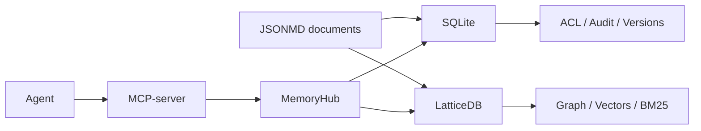

# TDB-Lattice-Agent-Memory

**Graph-native memory for AI agents.**
**Fork of TencentDB Agent Memory with LatticeDB storage backend and jsonmd support.**

---

## What is this?

**TDB-Lattice-Agent-Memory** is an independent open-source project that reimagines AI agent memory with **LatticeDB** — a single embedded database that combines **graph, vector, and full-text search** in one file.

It is a **fork of TencentDB Agent Memory**, replacing SQLite with LatticeDB as the search projection layer while keeping TencentDB's proven L0-L3 memory architecture, ACL, MCP-server, and MemoryHub panel.

---

## Key Features

| Feature | How it works |
| :--- | :--- |
| **Graph-native relationships** | LatticeDB stores explicit links between documents, code, and decisions. Graph traversal is **microsecond-fast** (9 µs per edge). |
| **Hybrid search** | BM25 + vector embeddings + RRF fusion — **0.83 ms** for 10-NN among 1M vectors. |
| **jsonmd documents** | Markdown content with JSON metadata + explicit `relationships`. Perfect for ADR, specs, changelogs, and plans. |
| **Single file per project** | No external Qdrant, Postgres, or Neo4j. Everything in one `.db` file. |
| **Memory layers (L0–L3)** | Inherited from TencentDB: raw conversations → atomic facts → scenarios → persona. |
| **ACL & visibility** | `private` / `team` / `restricted` — SQLite remains the source of truth for access control. |
| **MCP-server ready** | Works with OpenCode, OpenClaw, Claude Desktop, Cursor, and any MCP-compatible agent. |

---

## Architecture



- **SQLite** — canonical source of truth (documents, versions, ACL, outbox, audit).
- **LatticeDB** — disposable read/search projection (graph, embeddings, BM25, denormalized payload).
- **jsonmd** — document format with `---json` metadata block + Markdown body.

---

## Performance

| Metric | Value |
| :--- | :--- |
| Graph traversal (per edge) | **9 µs** |
| Vector search (10-NN, 1M vectors) | **0.83 ms** |
| Memory footprint (RSS) | **2.4 MB** |
| Full-text BM25 (100 docs) | **19 µs** |

> Compared to SQLite, LatticeDB is **5–78x faster** for graph operations and **3–13x faster** than Neo4j for local graph traversal.

---

## Quick Start

```bash
git clone https://github.com/YOUR-USERNAME/TDB-Lattice-Agent-Memory
cd TDB-Lattice-Agent-Memory/deploy/global-images
cp .env.example .env
# Fill LLM credentials
./start-all.sh
```

Open the panel: [http://localhost:8125](http://localhost:8125)

---

## Document Format (jsonmd)

```jsonmd
---json
{
  "type": "adr",
  "status": "approved",
  "module": "payment",
  "relationships": [
    { "target": "./spec-api.md", "type": "implements" },
    { "target": "../architecture/overview.md", "type": "relates" }
  ]
}
---
# ADR-023: New Payment Gateway

## Status
Approved

## Context
The old gateway is deprecated...
```

---

## Integration with AI Agents

| Agent / Client | Support |
| :--- | :--- |
| **OpenCode** | ✅ v2.0.1+ |
| **OpenClaw** | ✅ via plugin |
| **Claude Desktop** | ✅ via MCP |
| **Cursor** | ✅ via MCP |
| **CodeBuddy** | ✅ via Proxy |
| **Hermes** | ✅ via Python adapter |

---

## License

**MIT** (inherited from TencentDB Agent Memory)

---

## Acknowledgements

- [TencentDB Agent Memory](https://github.com/Tencent/TencentDB-Agent-Memory) — foundation and L0-L3 memory architecture
- [LatticeDB](https://github.com/jeffhajewski/latticedb) — graph + vector + FTS embedded database
- [jsonmd](https://www.piwheels.org/project/jsonmd/) — inspiration for the document format

---

## Links

- **GitHub**: https://github.com/dev993848/TDB-Lattice-Agent-Memory
- **Original project**: https://github.com/Tencent/TencentDB-Agent-Memory
- **LatticeDB**: https://github.com/jeffhajewski/latticedb
- **Discord**: [Join the community](https://discord.gg/dJQM6mKMF)

---

## Roadmap

- [x] LatticeDB adapter
- [x] jsonmd parser
- [x] Hybrid search (BM25 + vector + RRF)
- [x] ACL enforcement
- [ ] Full L0-L3 lifecycle
- [ ] CodeGraph with graph traversal
- [ ] MemoryHub graph visualization
- [ ] External embedding providers
- [ ] Multi-project support

---

**Build once. Remember forever.** 
```
